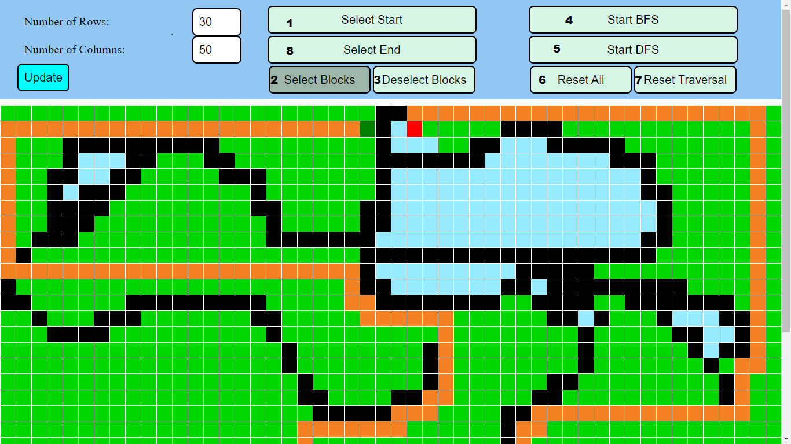
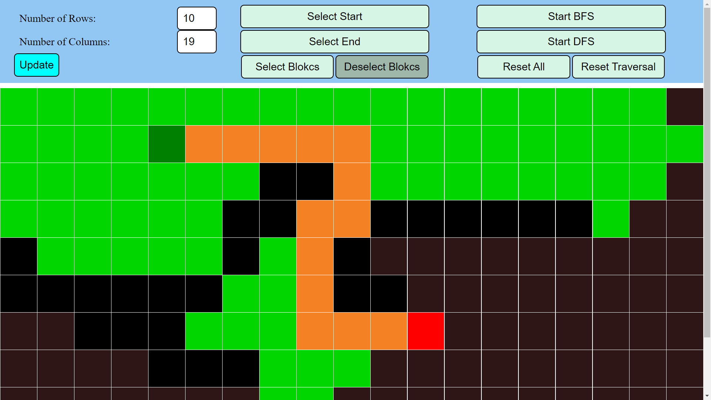

## THIS IS MADE TO VISUALIZE DFS AND BFS ALGORITHM

###
 
1. To select the source node
2. To select the blocks which blocks the path (`hold ctrl and move cursor for continuous selection of blocks`)
3. To deselect blocks which were selected as blocks (`hold ctrl and move cursor for continuous deselection of blocks`)
4. To start the BFS algorithm
5. To start the DFS algorithm
6. To reset all the selected nodes, blocks, visited nodes and paths
7. To only reset the visited nodes and paths
8. To select the end node

### Colors
| Color         | Work           |
| ------------- | -------------  |
| Light Green   | Visited Nodes  |
| Dark Green    | Start Node     |
| Black         | Blocks         |
| Red           | End Node       |
| Orange        | Path Nodes     |

### A sampe image of doing BFS on a grid.

